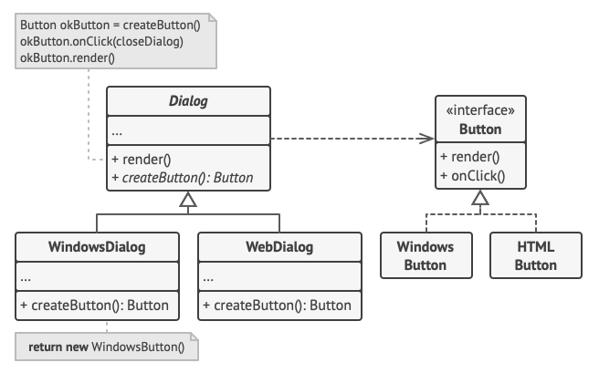
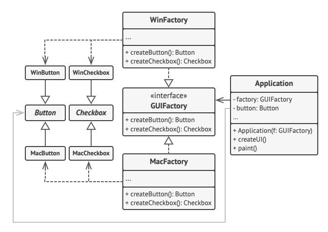
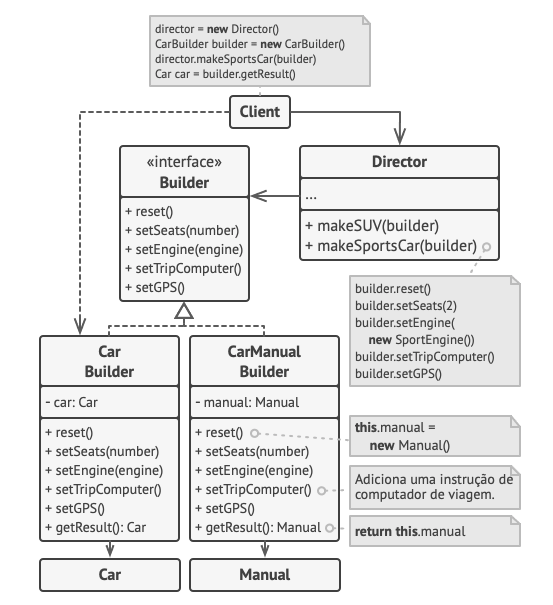

# Design Patterns - Creational

Os padrões criacionais fornecem vários mecanismos de criação de objetos, que aumentam a flexibilidade e reutilização de código já existente.

# Factory Method

O **Factory Method** é um padrão criacional de projeto que fornece uma interface para criar objetos em uma superclasse, mas permite que as subclasses alterem o tipo de objetos que serão criados.

## Diagrama



### Estrutura

1. O **Produto** declara a interface, que é comum a todos os objetos que podem ser produzidos pelo criador e suas subclasses.

2. **Produtos Concretos** são implementações diferentes da interface do produto.

3. A classe **Criador** declara o método fábrica que retorna novos objetos produto. É importante que o tipo de retorno desse método corresponda à interface do produto.<br><br>Você pode declarar o método fábrica como abstrato para forçar todas as subclasses a implementar suas próprias versões do método. Como alternativa, o método fábrica base pode retornar algum tipo de produto padrão.
   - Observe que, apesar do nome, a criação de produtos **não** é a principal responsabilidade do criador. Normalmente, a classe criadora já possui alguma lógica de negócio relacionada aos produtos. O método fábrica ajuda a dissociar essa lógica das classes concretas de produtos. Aqui está uma analogia: uma grande empresa de desenvolvimento de software pode ter um departamento de treinamento para programadores. No entanto, a principal função da empresa como um todo ainda é escrever código, não produzir programadores.

### Implementação

```ts
// A classe criadora declara o método fábrica que deve retornar
// um objeto de uma classe produto. As subclasses da criadora
// geralmente fornecem a implementação desse método.
export abstract class Dialog {
  // A criadora também pode fornecer alguma implementação
  // padrão do Factory Method.
  protected abstract createButton(): Button;

  // Observe que, apesar do seu nome, a principal
  // responsabilidade da criadora não é criar produtos. Ela
  // geralmente contém alguma lógica de negócio central que
  // depende dos objetos produto retornados pelo método
  // fábrica. As subclasses pode mudar indiretamente essa
  // lógica de negócio ao sobrescreverem o método fábrica e
  // retornarem um tipo diferente de produto dele.
  render(): void {
    // Chame o método fábrica para criar um objeto produto.
    const okButton = this.createButton();

    // Agora use o produto.
    okButton.onClick(() => {});
    okButton.render();
  }
}

// Criadores concretos sobrescrevem o método fábrica para mudar
// o tipo de produto resultante.
class WindowsDialog extends Dialog {
  protected createButton(): Button {
    return new WindowsButton();
  }
}

class WebDialog extends Dialog {
  protected createButton(): Button {
    return new HTMLButton();
  }
}

// A interface do produto declara as operações que todos os
// produtos concretos devem implementar.
interface Button {
  render(): void;
  onClick(closeDialog: () => void): void;
}

// Produtos concretos fornecem várias implementações da
// interface do produto.
class WindowsButton implements Button {
  render(): void {
    // Renderiza um botão no estilo Windows.
  }

  onClick(closeDialog: () => void): void {
    // Vincula um evento de clique do SO nativo.
  }
}

class HTMLButton implements Button {
  render(): void {
    // Renderiza um botão no estilo Windows.
  }

  onClick(closeDialog: () => void): void {
    // Vincula um evento de clique do SO nativo.
  }
}

class ApplicationConfigurator {
  // A aplicação seleciona um tipo de criador dependendo da
  // configuração atual ou definições de ambiente.
  initialize(): Dialog {
    const config = readApplicationConfigFile();

    switch (config.OS) {
      case "Windows":
        return new WindowsDialog();
      case "Web":
        return new WebDialog();
      default:
        throw new Error("Error! Unknown operating system.");
    }
  }
}

// O código cliente trabalha com uma instância de um criador
// concreto, ainda que com sua interface base. Desde que o
// cliente continue trabalhando com a criadora através da
// interface base, você pode passar qualquer subclasse da
// criadora.
const app = new ApplicationConfigurator();

// Durante o tempo de execução da aplicação, os métodos
// da fábrica podem ser chamados
const dialog = app.initialize();
dialog.render();
```

## Getting Started

Usando NPM:

```bash
npm run dev --factory-method web
```

Usando Yarn:

```bash
yarn dev --factory-method web
```

# Abstract Factory

O **Abstract Factory** é um padrão de projeto criacional que permite que você produza famílias de objetos relacionados sem ter que especificar suas classes concretas.

## Diagrama



### Estrutura

- **Produtos Abstratos** declaram interfaces para um conjunto de produtos distintos mas relacionados que fazem parte de uma família de produtos.

- **Produtos Concretos** são várias implementações de produtos abstratos, agrupados por variantes. Cada produto abstrato (botão/checkbox) deve ser implementado em todas as variantes dadas (Windows/Mac).

- A interface **Fábrica Abstrata** declara um conjunto de métodos para criação de cada um dos produtos abstratos.

- **Fábricas Concretas** implementam métodos de criação fábrica abstratos. Cada fábrica concreta corresponde a uma variante específica de produtos e cria apenas aquelas variantes de produto.

- Embora fábricas concretas instanciam produtos concretos, assinaturas dos seus métodos de criação devem retornar produtos abstratos correspondentes. Dessa forma o código cliente que usa uma fábrica não fica ligada a variante específica do produto que ele pegou de uma fábrica. O **Cliente** pode trabalhar com qualquer variante de produto/fábrica concreto, desde que ele se comunique com seus objetos via interfaces abstratas.

### Implementação

```ts
// A interface fábrica abstrata declara um conjunto de métodos
// que retorna diferentes produtos abstratos. Estes produtos são
// chamados de família e estão relacionados por um tema ou
// conceito de alto nível. Produtos de uma família são
// geralmente capazes de colaborar entre si. Uma família de
// produtos pode ter várias variantes, mas os produtos de uma
// variante são incompatíveis com os produtos de outra variante.
interface GUIFactory {
  createButton(): Button;
  createCheckbox(): Checkbox;
}

// As fábricas concretas produzem uma família de produtos que
// pertencem a uma única variante. A fábrica garante que os
// produtos resultantes sejam compatíveis. Assinaturas dos
// métodos fabrica retornam um produto abstrato, enquanto que
// dentro do método um produto concreto é instanciado.
class WinFactory implements GUIFactory {
  createButton(): Button {
    return new WinButton();
  }

  createCheckbox(): Checkbox {
    return new WinCheckbox();
  }
}

// Cada fábrica concreta tem uma variante de produto
// correspondente.
class MacFactory implements GUIFactory {
  createButton(): Button {
    return new MacButton();
  }

  createCheckbox(): Checkbox {
    return new MacCheckbox();
  }
}

// Cada produto distinto de uma família de produtos deve ter uma
// interface base. Todas as variantes do produto devem
// implementar essa interface.
interface Button {
  paint(): void;
}

// Produtos concretos são criados por fábricas concretas
// correspondentes.
class WinButton implements Button {
  paint(): void {
    // Renderiza um botão no estilo Windows.
  }
}

class MacButton implements Button {
  paint(): void {
    // Renderiza um botão no estilo macOS.
  }
}

// Aqui está a interface base de outro produto. Todos os
// produtos podem interagir entre si, mas a interação apropriada
// só é possível entre produtos da mesma variante concreta.
interface Checkbox {
  paint(): void;
}

class WinCheckbox implements Checkbox {
  paint(): void {
    // Renderiza uma caixa de seleção estilo Windows.
  }
}

class MacCheckbox implements Checkbox {
  paint(): void {
    // Renderiza uma caixa de seleção no estilo macOS.
  }
}

// O código cliente trabalha com fábricas e produtos apenas
// através de tipos abstratos: GUIFactory, Button e Checkbox.
// Isso permite que você passe qualquer subclasse fábrica ou de
// produto para o código cliente sem quebrá-lo.
class Application {
  private button?: Button;
  private checkbox?: Button;

  constructor(private factory: GUIFactory) {}

  createUi() {
    this.button = this.factory.createButton();
    this.checkbox = this.factory.createCheckbox();
  }

  paint() {
    this.button?.paint();
    this.checkbox?.paint();
  }
}

// A aplicação seleciona o tipo de fábrica dependendo da atual
// configuração do ambiente e cria o widget no tempo de execução
// (geralmente no estágio de inicialização).
class ApplicationConfigurator {
  main() {
    const config = readApplicationConfigFile();
    let factory: GUIFactory;

    switch (config.OS) {
      case "Windows":
        factory = new WinFactory();
        break;
      case "Mac":
        factory = new MacFactory();
        break;
      default:
        throw new Error("Error! Unknown operating system.");
    }

    return new Application(factory);
  }
}

const app = new ApplicationConfigurator().main();
app.createUi();

// Durante o tempo de execução da aplicação, os métodos
// da fábrica podem ser chamados.
app.paint();
```

## Getting Started

Usando NPM:

```bash
npm run dev --abstract-factory mac
```

Usando Yarn:

```bash
yarn dev --abstract-factory mac
```

# Builder

O **Builder** é um padrão de projeto criacional que permite a você construir objetos complexos passo a passo. O padrão permite que você produza diferentes tipos e representações de um objeto usando o mesmo código de construção.

## Diagrama



### Estrutura

- A interface **Builder** declara etapas de construção do produto que são comuns a todos os tipos de builders.

- **Builders Concretos** provém diferentes implementações das etapas de construção. Builders concretos podem produzir produtos que não seguem a interface comum.

- **Produtos** são os objetos resultantes. Produtos construídos por diferentes builders não precisam pertencer a mesma interface ou hierarquia da classe.

- A classe **Diretor** define a ordem na qual as etapas de construção são chamadas, então você pode criar e reutilizar configurações específicas de produtos.

- O **Cliente** deve associar um dos objetos builders com o diretor. Usualmente isso é feito apenas uma vez, através de parâmetros do construtor do diretor. O diretor então usa aquele objeto builder para todas as futuras construções. Contudo, há uma abordagem alternativa para quando o cliente passa o objeto builder ao método de produção do diretor. Nesse caso, você pode usar um builder diferente a cada vez que você produzir alguma coisa com o diretor.

### Implementação

```ts
// Usar o padrão Builder só faz sentido quando seus produtos são
// bem complexos e requerem configuração extensiva. Os dois
// produtos a seguir são relacionados, embora eles não tenham
// uma interface em comum.
class Car {
  // Um carro pode ter um GPS, computador de bordo, e alguns
  // assentos. Diferentes modelos de carros (esportivo, SUV,
  // conversível) podem ter diferentes funcionalidades
  // instaladas ou equipadas.
}

class Manual {
  // Cada carro deve ter um manual do usuário que corresponda
  // a configuração do carro e descreva todas suas
  // funcionalidades.
}

// A interface builder especifica métodos para criar as
// diferentes partes de objetos produto.
interface Builder {
  reset(): void;
  setSeats(seats: number): void;
  setEngine(engine: any): void;
  setTripComputer(hasTripComputer: boolean): void;
  setGPS(hasGPS: boolean): void;
}

// As classes builder concretas seguem a interface do
// builder e fornecem implementações específicas das etapas
// de construção. Seu programa pode ter algumas variações de
// builders, cada uma implementada de forma diferente.
class CarBuilder implements Builder {
  private car: Car;

  // Uma instância fresca do builder deve conter um objeto
  // produto em branco na qual ela usa para montagem futura.
  constructor() {
    this.reset();
  }

  // O método reset limpa o objeto sendo construído.
  reset() {
    this.car = new Car();
  }

  // Todas as etapas de produção trabalham com a mesma
  // instância de produto.
  setSeats(seats: number) {
    // Define o número de assentos no carro.
  }

  setEngine(engine: any) {
    // Instala um tipo de motor.
  }

  setTripComputer(hasTripComputer: boolean) {
    // Instala um computador de bordo.
  }

  setGPS(hasGPS: boolean) {
    // Instala um sistema de posicionamento global.
  }

  // Builders concretos devem fornecer seus próprios
  // métodos para recuperar os resultados. Isso é porque
  // vários tipos de builders podem criar produtos
  // inteiramente diferentes que nem sempre seguem a mesma
  // interface. Portanto, tais métodos não podem ser
  // declarados na interface do builder (ao menos não em
  // uma linguagem de programação de tipo estático).
  //
  // Geralmente, após retornar o resultado final para o
  // cliente, espera-se que uma instância de builder comece
  // a produzir outro produto. É por isso que é uma prática
  // comum chamar o método reset no final do corpo do método
  // `getProduct`. Contudo este comportamento não é
  // obrigatório, e você pode fazer seu builder esperar por
  // uma chamada explícita do reset a partir do código cliente
  // antes de se livrar de seu resultado anterior.
  getProduct(): Car {
    const product = this.car;

    this.reset();
    return product;
  }
}

// Ao contrário dos outros padrões criacionais, o Builder
// permite que você construa produtos que não seguem uma
// interface comum.
class CarManualBuilder implements Builder {
  private manual: Manual;

  constructor() {
    this.reset();
  }

  reset() {
    this.manual = new Manual();
  }

  setSeats(seats: number) {
    // Documenta as funcionalidades do assento do carro.
  }

  setEngine(engine: any) {
    // Adiciona instruções do motor.
  }

  setTripComputer(hasTripComputer: boolean) {
    // Adiciona instruções do computador de bordo.
  }

  setGPS(hasGPS: boolean) {
    // Adiciona instruções do GPS.
  }

  getProduct(): Manual {
    // Retorna o manual e reseta o builder.

    const product = this.manual;

    this.reset();
    return product;
  }
}

// O diretor é apenas responsável por executar as etapas de
// construção em uma sequência em particular. Isso ajuda quando
// produzindo produtos de acordo com uma ordem específica ou
// configuração. A rigor, a classe diretor é opcional, já que o
// cliente pode controlar os builders diretamente.
class Director {
  // O diretor trabalha com qualquer instância builder que
  // o código cliente passar a ele. Dessa forma, o código
  // cliente pode alterar o tipo final do produto recém
  // montado. O diretor pode construir diversas variações
  // do produto usando as mesmas etapas de construção.
  constructSportsCar(builder: Builder) {
    builder.reset();
    builder.setSeats(2);
    builder.setEngine(new SportEngine());
    builder.setTripComputer(true);
    builder.setGPS(true);
  }

  constructSUV(builder: Builder) {
    // ...
  }
}

// O código cliente cria um objeto builder, passa ele para o
// diretor e então inicia o processo de construção. O resultado
// final é recuperado do objeto builder.
class Application {
  makeCar() {
    const director = new Director();

    const carBuilder: CarBuilder = new CarBuilder();
    director.constructSportsCar(carBuilder);
    const car: Car = carBuilder.getProduct();

    const carManualBuilder: CarManualBuilder = new CarManualBuilder();
    director.constructSportsCar(carManualBuilder);

    // O produto final é frequentemente retornado de um
    // objeto builder uma vez que o diretor não está
    // ciente e não é dependente de builders e produtos
    // concretos.
    const manual: Manual = carManualBuilder.getProduct();
  }
}
```

## Getting Started

Usando NPM:

```bash
npm run dev --builder sport
```

Usando Yarn:

```bash
yarn dev --builder sport
```
